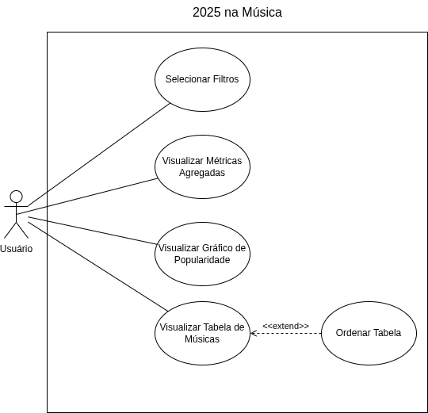

# 2025 na Música
Análise de dados da playlist **2025 na Música** do Spotify

🎵 [Playlist](https://open.spotify.com/playlist/32f0uBOvtYHqzmDZy6ZXRv?si=3RWD5UEBQeGWw1zBBus5kA)

🎯 [Dashboard](https://2025-na-musica.streamlit.app/)

---

## 🆔 Identificação do Sistema

**Nome:** Dashboard da Playlist 2025 na Música do Spotify  
**Tecnologia:** Python + Streamlit  
**Fonte de dados:** Arquivo `.csv` hospedado no GitHub  
**Plataforma:** Web (via navegador)

---

## 📎 Diagrama de Caso de Uso

O diagrama abaixo representa os principais atores e funcionalidades do sistema de análise da Playlist 2025 na Música do Spotify.

---

## 📌 Requisitos Funcionais

**RF01 -** O sistema deve carregar os dados da playlist 1K a partir de um arquivo CSV hospedado em uma URL pública do GitHub.  
**RF02 -** O sistema deve exibir filtros laterais que permitam a seleção múltipla de valores para as categorias: década, gênero musical e artista.  
**RF03 -** O sistema deve filtrar e atualizar dinamicamente os dados exibidos conforme os filtros aplicados pelo usuário, refletindo as músicas correspondentes.  
**RF04 -** O sistema deve permitir a visualização completa da playlist quando nenhum filtro for aplicado.  
**RF05 -** O sistema deve exibir, no topo do dashboard, métricas agregadas dos dados filtrados ou não, incluindo: total de músicas, média da popularidade, total de artistas distintos e total de gêneros distintos.  
**RF06 -** O sistema deve gerar e exibir um gráfico de barras com a popularidade média por gênero musical, baseado no conjunto de dados filtrado.  
**RF07 -** O sistema deve apresentar uma tabela detalhada das músicas filtradas, contendo as seguintes colunas: Música, Artista, Gêneros, Popularidade e Década.  
**RF08 -** O sistema deve permitir que o usuário visualize informações atualizadas em tempo real conforme interage com os filtros.  

---

## 🛠️ Requisitos Não Funcionais

**RNF01 –** O sistema deve carregar e exibir os dados de forma ágil, proporcionando uma experiência fluida ao usuário durante a interação com filtros e gráficos, considerando as limitações da plataforma.  
**RNF02 –** A interface deve ser intuitiva e organizada, permitindo que usuários apliquem os filtros e visualizem as informações de maneira simples, sem necessidade de treinamento prévio.  
**RNF03 –** O sistema deve tratar adequadamente dados ausentes na tabela, prevenindo falhas durante a execução.  
**RNF04 –** Os dados exibidos são atualizados somente pelo mantenedor do repositório remoto, sem possibilidade de atualização pelo usuário final, garantindo controle centralizado das informações apresentadas.  
**RNF05 –** O sistema deve ser acessível via navegador web em diferentes dispositivos, incluindo desktops e dispositivos móveis, sem necessidade de instalação ou cadastro do usuário.  
**RNF06 –** A comunicação para carregamento dos dados e acesso ao sistema é feita via protocolo seguro (HTTPS), garantindo a integridade e segurança da transmissão.  
**RNF07 –** O sistema deve utilizar mecanismos de cache para otimizar o desempenho, evitando recargas desnecessárias dos dados durante a mesma sessão.

---

